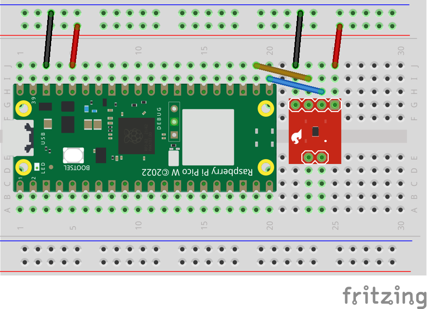

# CO2 Monitor

The goal of this project is to create a network of CO2 sensors for indoor air quality monitoring. See our [project proposal](https://github.com/EricSchrock/co2-monitor/blob/main/submissions/proposal.pdf) for more detail on our motivation and goals.

&nbsp;
## Design

Our system is composed of a variable number of sensor units, which wirelessly report CO2 readings back to a base station. The base station presents these readings via a locally hosted website.

The base station is a Raspberry Pi 4B. We considered a range of [microcontrollers](https://github.com/EricSchrock/co2-monitor/blob/main/docs/microcontroller.md) and [CO2 sensors](https://github.com/EricSchrock/co2-monitor/blob/main/docs/co2-sensor.md) for the sensor unit. We settled on the Raspberry Pi Pico W connected to a Sparkfun ENS160 sensor over I2C.

| System                         | Sensor Unit                    |
|--------------------------------|--------------------------------|
|  |  |

Note: The CO2 sensor shown in the Fritzing diagram above does not match the actual part and is only meant to give a general sense of the design.

&nbsp;
## Tasks

Hardware
  - [x] [First prototype: Just get something working](https://github.com/EricSchrock/co2-monitor/blob/main/docs/first-prototype.md)
    - [x] Diagram initial system architecture
    - [x] Diagram initial sensor unit
    - [x] [Choose which microcontroller to use for the sensor unit](https://github.com/EricSchrock/co2-monitor/blob/main/docs/microcontroller.md)
    - [x] [Choose which CO2 sensor to use](https://github.com/EricSchrock/co2-monitor/blob/main/docs/co2-sensor.md)
    - [x] Create parts list (including tools)
    - [x] Research/test whether to put a capacitor on the power rail between the microcontroller and CO2 sensor (some microcontrollers have built in capacitance on their power outputs)
    - [x] Research/test whether pull up resistors are needed on the I2C SDA and SCL lines between the microcontroller and CO2 sensor (some microcontrollers have built in or configurable pull ups on pins)
  - [ ] Second prototype: Consider cost, size, and power usage
    - [x] Choose breadboard size (mini, tiny, half, or half+)
    - [ ] Bill of Materials (BOM) including costs, part numbers, and supplier links

Software
  - [x] Sensor readings displayed on sensor unit (via debugger, attached LCD, etc.)
  - [ ] Sensor readings displayed on base station (over Bluetooth, Wi-Fi, or BLE)
    - [x] Wi-Fi
    - [ ] Bluetooth or BLE (BLE preferable)
  - [ ] Sensor readings displayed on locally hosted website served from the base station
    - [ ] Live readings
    - [ ] Historical trends
    - [ ] Multiple sensors

&nbsp;
## Resources

 - <https://www.raspberrypi.com/documentation/microcontrollers/raspberry-pi-pico.html>
 - <https://projects.raspberrypi.org/en/projects/getting-started-with-the-pico/0>
 - <https://datasheets.raspberrypi.com/picow/connecting-to-the-internet-with-pico-w.pdf>
 - <https://cdn.sparkfun.com/assets/3/c/7/5/5/SC-001224-DS-7-ENS160-Datasheet.pdf>
