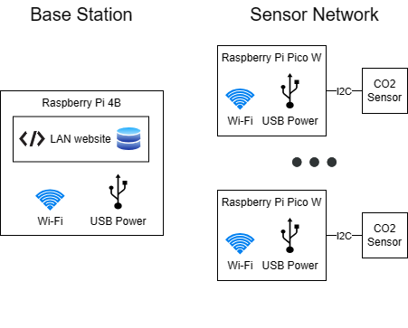
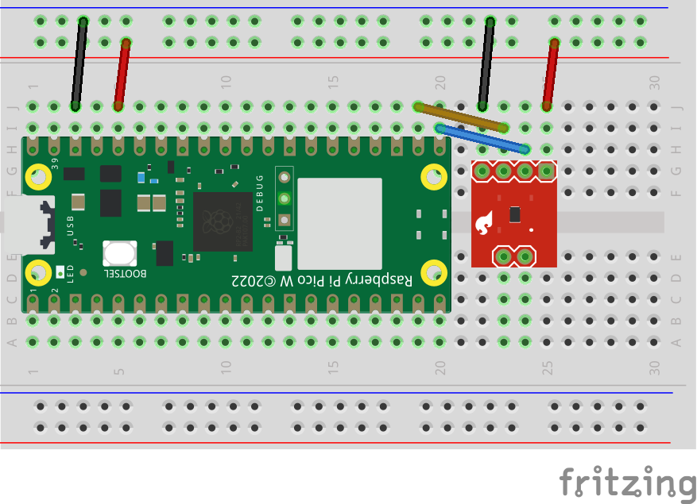
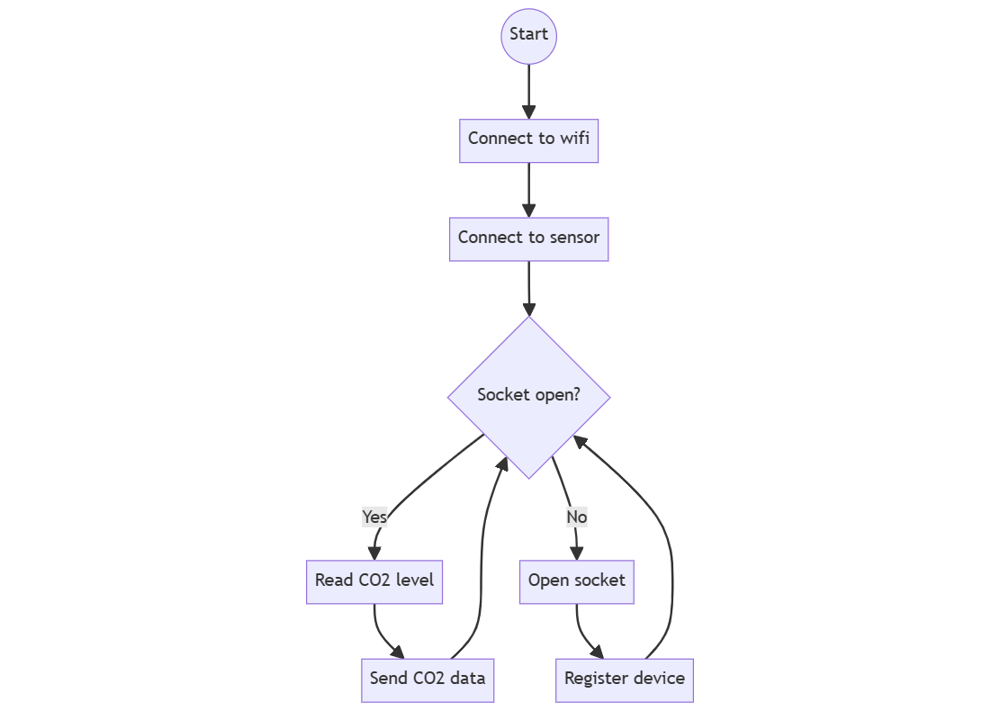
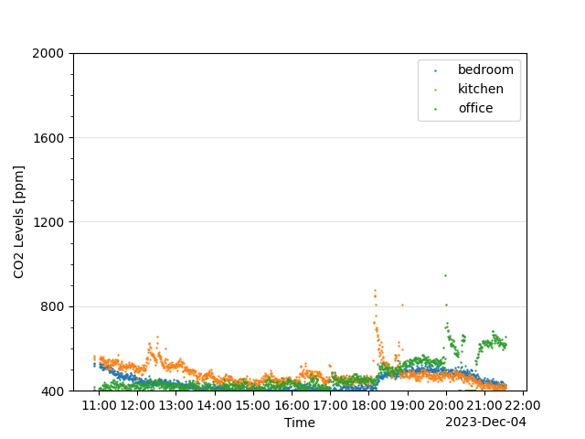
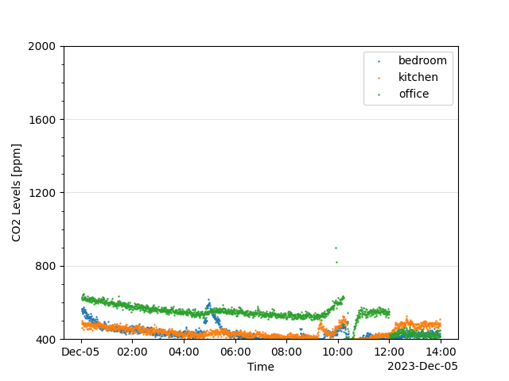

% **CS 437: Internet of Things** \
  **Final Project Report**
---
urlcolor: cyan
---

## Team

* Eric Schrock (ejs9)
* Devin Schmitz (devinms3)

## Overview

We created a distributed network of CO2 sensors that report back via wifi to a central hub. The hub exposes a web interface on the LAN for accessing the data. This allows us to track variations in CO2 levels throughout a home and over time. This data could be used to understand and improve indoor air quality, leading to healthier lives.

## Motivation

Breathing is one of the most fundamental processes of our lives, but most homes
are only equipped with smoke and carbon monoxide detectors, which just warn
against critically dangerous levels of air polution. High levels of pollutants
like Carbon Dioxide (CO2), particulate matter (PM), and volatile organic
compounds (VOCs) can go unnoticed, contributing to drowsiness, illness, and
poor cognitive function, among many other potential poor health
outcomes[^20][^21][^22].

Large pollutants can be filtered out by a good HVAC or air filtration system,
but small asphyxiants such as CO2 and VOCs are best managed with proper air
ventilation. However, the exchange of fresh outdoor air for indoor air works
against the mission of modern HVAC, door, and window systems, which attempt to
maintain a consistent internal climate (in spite of the surrounding
environment) by _avoiding_ the exchange of indoor and outdoor air.

It is easy to open a window during the spring and fall when the weather is
nice, but knowing when it is necessary to open a window for proper air
circulation during the cold winter or hot summer can be a challenge. Having a
window open all the time wastes energy heating excess fresh air, but fatigue
and headache from poor air quality only exacerbates common ailments like
seasonal depression.

The first step to balancing this tension is having data. CO2 serves as a good
proxy for appropriate air ventilation in general. CO2 is a direct byproduct of
respiration and combustion, so indoor levels rise throughout the day as we
breath and use gas appliances like stoves, hot water heaters, and furnaces. By
monitoring indoor CO2 levels, we can have a better idea of when there is
adequate ventilation and when more fresh air exchange is needed.

However, proper air monitoring requires a distributed network. A single sensor,
though useful, does not provide a comprehensive picture of the air quality
throughout a home (especially in homes with poor overall ventilation). A
network of sensors also reduces inaccuracy due to any single faulty sensor
reading and keeps the system more robust to sensor failures. Additionally, many
existing air monitoring solutions are cost prohibitive to deploy across a home,
with individual sensors costing up to $230[^23] and coming with a list of extra
and unnecessary features like onboard data processing and display.

We designed a simple, low cost CO2 sensor that can be deployed throughout a
home for real time monitoring of air quality with a single central hub for
processing and displaying the data via a convenient web application on the
local area network.

[^20]: <https://ehp.niehs.nih.gov/doi/10.1289/ehp.1510037>
[^21]: <https://papers.ssrn.com/sol3/papers.cfm?abstract_id=4296077>
[^22]: <https://www.niehs.nih.gov/health/topics/agents/air-pollution/index.cfm>
[^23]: <https://www.airthings.com//wave-plus>

## Technical Approach

Our overall system consists of a base station connected to a network of sensors over wifi. The base station is a Raspberry Pi 4B running a server. Sensors connect to the server and periodically report CO2 measurements. The base station then presents those measurements on a website available on the local area network.

Each sensor consists of a Raspberry Pi Pico WH connected to a CO2 sensor over I2C. Each sensor runs a client that is responsible for connecting to the server on the base station, reading CO2 measurements, and sending those measurements to the base station.

Note: The CO2 sensor shown in figure 2 does not match the actual part and is only meant to give a general sense of the design.

todo: Add a high-level diagram of the server code (details belong in the next section)

todo: Add a high-level diagram of the website code (details belong in the next section)

## Implementation Details

### Sensors

We spent a significant amount of time comparing[^1] different options for the microcontroller on our sensors units. We started our search with six different Arduino variants (five Nano variants and the Micro). We looked at price, availability, breadboard compatibility, power and IO options, and connectivity (wifi, Bluetooth, and BLE). We were leaning towards the Arduino Nano 33 IoT[^2] when we found the Raspberry Pi Pico WH[^3] [^4], which checked all our boxes but for a much cheaper price ($7 vs $27).

[^1]: <https://github.com/EricSchrock/co2-monitor/blob/main/docs/microcontroller.md>
[^2]: <https://store-usa.arduino.cc/products/arduino-nano-33-iot-with-headers>
[^3]: <https://www.raspberrypi.com/documentation/microcontrollers/raspberry-pi-pico.html>
[^4]: <https://www.pishop.us/product/raspberry-pi-pico-wh-pre-soldered-headers>

The Pico comes with both C/C++[^5] and Python[^6] SDKs. We are both embedded C programmers for our day job, so we picked the Python SDK to get some experience with MicroPython[^7]. Additionally, the simplicity of Python fit with a simple prototype on a tight timeline.

[^5]: <https://datasheets.raspberrypi.com/pico/raspberry-pi-pico-c-sdk.pdf>
[^6]: <https://datasheets.raspberrypi.com/pico/raspberry-pi-pico-python-sdk.pdf>
[^7]: <https://micropython.org/>

We also considered[^8] multiple CO2 sensors, before settling on the ENS160[^9]. Our criteria were price, availability, breadboard compatibility, and power and IO options.

[^8]: <https://github.com/EricSchrock/co2-monitor/blob/main/docs/co2-sensor.md>
[^9]: <https://www.sciosense.com/wp-content/uploads/documents/SC-001224-DS-9-ENS160-Datasheet.pdf>

Additionally, we had to consider whether to choose a true CO2 sensor or an equivalent CO2 (eCO2[^10]) sensor. eCO2 sensors don't measure CO2 directly. Instead, they measure total volatile organic components (TVOC) and use that measurement to estimate the CO2 level. eCO2 sensors are much cheaper but are less accurate. We chose to go with an eCO2 sensor, as price is a big factor in our design. Having multiple sensor units allowed us to sanity check the reported values and notice anomalies. Given this, the eCO2 sensor was accurate enough to observe trends and draw conclusions. More on this in the CO2 Data Analysis portion of the Results section.

[^10]: <https://electronics360.globalspec.com/article/17986/what-are-eco2-sensors>

The SparkFun ENS160[^11] came with the option to communicate over I2C or SPI. We chose I2C because it was simpler to implement in MicroPython.

[^11]: <https://www.sparkfun.com/products/20844>

The Pico supports wifi, Bluetooth, and BLE. We initially planned to use BLE to communicate with the server, but implementing wifi communication turned out to be much simpler. Additionally, power usage turned out to be less of a concern than we initially thought because we chose to power the sensor units off wall power instead of batteries.

We chose to connect up the Pico and ENS160 on a half sized breadboard and to power them both through the micro USB port on the Pico. We built both dev units and full prototypes.

{width=40%}
{width=60%}
\begin{figure}[!h]
\caption{Development Unit (left) and Full Prototypes (right)}
\end{figure}

The software development for the sensor unit was relatively straight forward. We wrote simple programs to aid hardware bring up, first to blink the Pico LED and then to turn the Pico LED on when we breathed on the CO2 sensor. Then we created a simple program that connects to wifi, connects to the CO2 sensor via I2c, connects to the server, and then periodically reads and reports the CO2 level (see the sensor flow chart above in the Technical Approach section).

### Server

In choosing the hardware for the central server, we quickly decided to use the
Raspberry Pi 4B[^41] that we had both already purchased for earlier labs in the
class. The Raspberry Pi 4B provides a builtin wifi module to connect to the
sensor units and sufficient processing power and RAM to host a basic webpage
and do minimal data processing. In fact, the Raspberry Pi 4B far exceeded our
basic requirements for a server. If we were going to productionize the system,
we would explore using a smaller Raspberry Pi with less RAM or potentially an
even simpler SBC to reduce the cost of the system.

{width=70%}

In designing the server software, our goal was simplicity, reliability, and
minimal dependencies. We wrote the entire server application using just the
Python standard library. We started with a simple server that could connect to
one sensor using sockets, using what we had learned from our previous labs.
Then, we extended the server and our knowledge of sockets programming by
incorporating a selector[^42] to handle multiple socket connections to
different sensors. Throughout the server development, we took advantage of the
ability to create socket pairs on a single device to emulate a sensor network
locally for debugging, which allowed us to parallelize the sensor and server
development.

When it came to storing CO2 data, we considered integrating a proper database.
However, after looking into it, even a simple SQL database[^43] seemed like
unnecessary overhead and complexity for the data we were storing. We settled on
storing the data in basic CSV files to make both writing the data and loading
it for later analysis easy. Our first iteration of data logging had a unique
file for each sensor, which contained the full date-time timestamp for each CO2
reading. It quickly became apparent that this was suboptimal for two reasons.
First, having all CO2 data from one sensor in a single file meant that
significantly more data would have to be parsed to analyze a small time window
of data. Second, including the date in every timestamp was a significant
duplication of data and thus waste of memory. We settled on splitting up the
data by date instead, so that each day's readings would be stored in a
directory with a CSV file for each sensor that only contained the timestamps
for the CO2 readings.

[^41]: https://www.raspberrypi.com/products/raspberry-pi-4-model-b/
[^42]: https://docs.python.org/3/library/selectors.html
[^43]: https://docs.python.org/3/library/sqlite3.html

### Website

Since neither of us has web development experience, we were learning
everything as we went. This meant simplicity and basic functionality were high
priorities as we chose software stacks for our web application. We are both
comfortable with Python, so it made sense to use a backend Python framework. We
considered two dominant web frameworks: Django[^31] and Flask[^32]. Each has
pros and cons, and both are widely used in industry. However, we settled on
Flask for two key reasons. First, it is faster to get a minimal web application
up and running from scratch in Flask. Second, Flask uses `jinja2`[^37]
templates by default, which we were already familiar with.

From there, the development of the website evolved in stages. First, we setup
a basic "Hello World" page to verify that we could successfully run our Flask
application. Then, we upgraded the application to include a request form for a
date, which we initially just echoed to the webpage. Finally, we updated the
web app to display the list of CO2 reading times and values for the selected
date.

At this stage, we had to decide on a software stack to generate the most
important part of the web application: a chart of the data. We considered
three options: Chart.js[^33], Matplotlib[^34], and plotlib[^35] with
WebAssembly[^36]. These three options vary significantly, from the language
used (Javascript, Python, and Rust respectively) to how they integrate into the
Flask application. While the Rust and WebAssembly option was interesting to
explore, WebAssembly is a relatively new technology and doesn't have the same
level of existing examples and documentation as the more established
competitors. Chart.js was a compelling option, with support for dynamic and
interactive charts in a web-native language. However, Matplotlib had a few
great examples for integrating charts into a webpage and was already familiar
to us, so it won out as the best option to meet the goals and timelines of this
project. Additionally, in brief prototyping, a webpage with a matplotlib image
reloaded nearly instantaneously, while plotting the same data with Chart.js had
a noticeable (several second) delay.

Finally, we needed to choose a WSGI server to host our web application. We
considered several of the options on Flask's list of recommended self-hosted
WSGI servers[^38]. We chose Waitress[^39] because it is a pure Python
application with no dependencies, which made it easy to include in our project.

[^31]: https://docs.djangoproject.com/en/5.0/
[^32]: https://flask.palletsprojects.com/en/3.0.x/
[^33]: https://www.chartjs.org/
[^34]: https://matplotlib.org/stable/index.html
[^35]: https://docs.rs/plotlib/latest/plotlib/
[^36]: https://rustwasm.github.io/
[^37]: https://jinja.palletsprojects.com/en/3.1.x/templates/
[^38]: https://flask.palletsprojects.com/en/3.0.x/deploying/
[^39]: https://docs.pylonsproject.org/projects/waitress/en/stable/

## Results

### Project Timeline

Overall, the project probably took a little over the projected 45 hours. The bookends, the initial design decisions and the project report, took much more time than planned, but the hardware bring up was exceptionally smooth and we did not need the planned second prototype. Our time estimates for the website were about right.

### Project Objectives

At a high level, we met the objective we laid out in our project proposal, which was "to create a network of CO2 sensors with a web interface" to allow "distributed monitoring of indoor air quality." Our proposal also laid out the objectives of "simple, low cost, low energy" sensors.

We met the objective of simple sensors. We avoided extra functionality that would have increased cost and complexity (e.g. multi-function sensors or extra website features). We also kept the setup instructions[^12] simple (for a prototype).

[^12]: <https://github.com/EricSchrock/co2-monitor/blob/main/src/README.md>

As our design evolved from a battery powered sensor to a wall powered sensor, we dropped the objective of being low energy. This allowed us to make tradeoffs in favor of simplicity and speed. For example, it allowed us to keep our code simple by using wifi instead of BLE and by not implementing any low power modes. Now that we have a working prototype that has proved it's value, power usage optimization would be a valuable consideration for a second prototype.

We also met the objective of low cost sensors, with each sensor unit costing roughly $40. A productionized sensor unit, benefiting from economies of scale, could cost even less.

The base station prototype is pricier at $88. This is largely because we used the 8 GB Raspberry Pi 4B because it is what we had on hand. Using the 1 GB model would drop the base station cost to $48. A simple website doesn't take much compute power. A productionized version of the base station could use an even cheaper processor. It's even possible that one of the sensor units could function as the server for the rest of the sensor network.

**Sensor Unit**

| Part                   | Price* | Link                                                                                  |
|------------------------|--------|---------------------------------------------------------------------------------------|
| Raspberry Pi Pico WH   |  $7.00 | <https://www.pishop.us/product/raspberry-pi-pico-wh/>                                 |
| 12.5W power supply     |  $8.00 | <https://www.pishop.us/product/raspberry-pi-12-5w-power-supply-us-white/>             |
| Sparkfun ENS160        | $19.95 | <https://www.sparkfun.com/products/20844>                                             |
| Half sized bread board |  $4.75 | <https://www.pishop.us/product/half-size-400-pin-diy-breadboard-white/>               |
| Wires and headers      |  $0.30 |                                                                                       |
| **Total**              | $40.00 |                                                                                       |

*Price does not include shipping or bulk discounts.

\
**Base Station**

| Part                   | Price* | Link                                                                       |
|------------------------|--------|----------------------------------------------------------------------------|
| Raspberry Pi 4B (8 GB) | $75.00 | <https://www.pishop.us/product/raspberry-pi-4-model-b-8gb/>                |
| 15W power supply       |  $8.00 | <https://www.pishop.us/product/raspberry-pi-15w-power-supply-us-white/>    |
| Case                   |  $5.00 | <https://www.pishop.us/product/raspberry-pi-4-case-red-white/>             |
| **Total**              | $88.00 |                                                                            |

*Price does not include shipping or bulk discounts.

\pagebreak
### CO2 Data Analysis

One question we had was whether our sensors would be accurate enough to provide useful data. We found that the data trends were reliable enough to interpret and act on. For example, below is around thirteen hours of CO2 data from three different rooms. Below that is a list tying trends in the data to my (Eric's) activity that day.

{width=90%}

1. 11 AM - 2 PM: The bedroom CO2 level drops from its nighttime high.
2. 12 - 1 PM: The kitchen CO2 level jumps as my wife and I eat lunch.
3. 1 - 6:15 PM: The bedroom sits empty and has the lowest CO2 level. I sit at my desk in my office and my wife moves around the kitchen and adjoining living room. The kitchen CO2 level is higher than the office CO2 level because humans breath out more CO2 when we are active.
4. 6:15 PM: The kitchen CO2 level spikes when we vent the pressure cooker and then dissipate to the rest of the house, leaving every room at a higher CO2 level.
5. 6:30 - 7 PM: The kitchen CO2 level jumps as my wife and I eat supper.
6. 7 - 9:30 PM: My wife leaves for time with friends and I return to my office. The kitchen CO2 level drops below that of the office.
7. 8:15 PM: I briefly open a window in my office. The office CO2 level drops to the minimum sensor value of 400 ppm, but jumps back up as soon as I close the window.
8. 8:30 - 8:45 PM: I open a window in my office for 15 minutes. The office CO2 level again drops to the minimum, but jumps back as soon as the window is closed.
9. 9:30 - 10:15 PM: My wife returns and we spend time together in the living room, near the kitchen. The kitchen CO2 level jumps.
10. 10:15 PM: We go to bed. The kitchen CO2 level drops and the bedroom CO2 level jumps.

The sensors do have a couple issues to keep in mind. First, as explained in the section on implementation details, they are measuring eCO2 which is an estimate of CO2 levels derived from TVOC levels. TVOCs can spike without CO2 spiking. For example, the data above shows a spike in the office CO2 levels at around 8 PM. This was from running a paper shredder near the sensor.

Second, the sensor results can occasionally get stuck at a high offset until they are power cycled. The CO2 level in the office jumped significantly the evening of December 4th (above) and remained high into the next day (below). I first tried opening windows throughout the house from 10:15 - 10:30 AM. The other rooms responded to this, but the office CO2 level jumped back up as soon as the windows were closed. At around noon, I power cycled the office sensor.

{width=90%}

Despite these issues, we believe that the sensor data captured is accurate enough to drive decisions, such as whether to open windows or whether to invest in a new HVAC that cycles in outdoor air in response to high indoor CO2 levels, as long as the sensor limitations are kept in mind.

todo (Devin): Do you have any interesting data or observations to add? How does your data compare to mine?

## Demo Videos

We recommend watching these videos on a large screen and/or setting your video player to HD/1080p.

* [Hardware Demo](TBD)
* [Website Demo](TBD)

todo (Eric): Record a demo video of how to setup the hardware.

* Sensor and base station hardware
* Installation (https://github.com/EricSchrock/co2-monitor/blob/main/src/README.md)
* Talk through LED transitions
* Show server log and CO2 data files

todo (Devin): Record a demo video of how to use the website.

* Installation (https://github.com/EricSchrock/co2-monitor/blob/main/src/README.md)
* Talk through and demo website features
  * Date selection
  * Sensor/room selection
  * Refresh for latest data
* Talk through interesting trends observed in the data

## Project Repository

https://github.com/EricSchrock/co2-monitor

## What We Learned

### Eric

Two of the key skills I learned in this project were networking via the Python sockets library and how to configure Linux using the `/etc/rc.local` file and `cron` jobs. Both were completely new to me and are valuable experiences for the future.

On a different note, I was surprised by how easy it was to get the project up and running on the Raspberry Pi Pico with MicroPython. I'm used to embedded boards being much more painful to bring up. Perhaps some personal projects I thought would be too time consuming are actually in reach!

This project also taught me about the health impacts of high concentrations of CO2 in indoor spaces. This is important knowledge to help me stay sharp. As a remote worker, I can put what I've learned to use by opening my office windows at key times.

### Devin

I learned a great deal from working with the hardware in this lab. I soldered
header pins for the first time. I gained valuable experience reading the ENS160
datasheet to understand how to read sensor values over I2C. I learned how to
use `minicom` to view serial data from the Pi Pico and how to prototype
micropython on the Pi Pico from the interactive micropython REPL.

This project significantly expanded my understanding and confidence in socket
programming, which I had only just learned in previous class labs. It also
challenged me to write a safe and robust server application.

Building the webpage may have taught me the most. Weighing different Python web
frameworks gave great insight into the infrastructure underlying websites and
web applications that I use on a daily basis. Actually deploying a functional
web form involved more pieces than I knew and gave me a new respect for web
development.

### If We Had More Time

If we were to take this project further, we would have three main goals. The first would be to increase the accuracy of the sensor readings, either by tuning them with temperature and humidity readings reported to them by the base station or by automatically power cycling the ENS160 CO2 sensor periodically.

Second, we would expand the functionality of the website. We would add the ability to save timestamped notes to mark and explain phenomena in the data. We would also make the time interval for the display configurable. Additionally, we would add simple statistics, such as the max and average over the selected time interval.

The third goal would be to condense the sensor unit into a wall wart with a protective housing. We would look into 3D printing for the case and into a custom PCB to fit in a smaller form factor.

## Conclusion

In conclusion, we accomplished the high level goal of our project, to prototype a distributed, networked, and affordable CO2 monitoring solution. Along the way, we tried new technologies, built new skills, and gained a deeper understanding of the quality of the air in our homes and of how it impacts our health.
