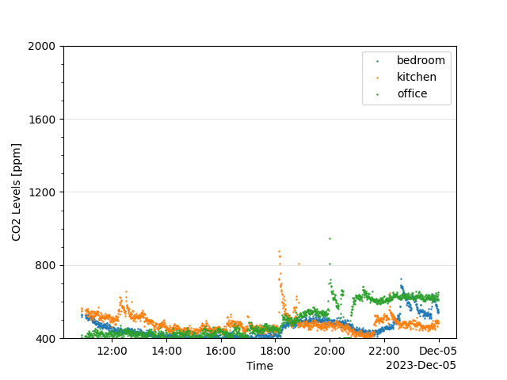

% **CS 437: Internet of Things** \
  **Final Project Report**
---
urlcolor: cyan
---

## Team

* Eric Schrock (ejs9)
* Devin Schmitz (devinms3)

## Overview

We created a distributed network of CO2 sensors that report back via wifi to a central hub. The hub exposes a web interface on the LAN for accessing the data. This allows us to track variations in CO2 levels throughout a home and over time. This data could be used to understand and improve indoor air quality, leading to healthier lives.

## Motivation

todo: "Talk about the importance of this problem. Pretend you are trying to convince someone to give you funding, or purchase what you developed. You may also want to give references/citations here."

todo: Rehash motivation section from the proposal. Maybe remove "low energy" as a design goal.

## Technical Approach

Our overall system consists of a base station connected to a network of sensors over wifi. The base station is a Raspberry Pi 4B running a server. Sensors connect to the server and periodically report CO2 measurements. The base station then presents those measurements on a website available on the local area network.

Each sensor consists of a Raspberry Pi Pico WH connected to a CO2 sensor over I2C. Each sensor runs a client that is responsible for connecting to the server on the base station, reading CO2 measurements, and sending those measurements to the base station.

Note: The CO2 sensor shown in the Fritzing diagram above does not match the actual part and is only meant to give a general sense of the design.

todo: Add a high-level diagram of the server code (details belong in the next section)

todo: Add a high-level diagram of the website code (details belong in the next section)

## Implementation Details

todo: "This is where you give the details in your implementation. Talk
about specific software packages you used, hardware modules, any algorithms or
research papers you referred to, data structure and protocol choices, etc. You should
provide at least an informal list of citations of all these external materials that went into
your project."

Ideas

* Pictures of the actual sensors (Devin's and Eric's versions)
* Picture of the hub
* Links to websites of parts and technologies used
* Talk through how we chose the uC (Pico vs Arduino) and CO2 sensor (CO2 vs eCO2) [^1]
* Talk through how we chose a Raspberry Pi Pico dev language (Python vs C)
* Talk through how we chose the networking technology (wifi over BLE)
* Talk through how we chose the web technology (Flask?)

[^1]: <https://electronics360.globalspec.com/article/17986/what-are-eco2-sensors>

## Results

todo: "So, how did things turn out? You can provide performance results, experiences
you had interacting with it, etc. Also talk about what the takeaway is - why should we
care about your results? And, it is ok for things to go wrong - what did not go right in your
project, what was hard and what lessons did you learn?"

Ideas

* Talk about price (compared to CO2 sensor mentioned in the motivation section) (see the BOM in the repo README)
* Talk about productionization
  * Refactor into wall wart with a custom PCB and protective case
  * Solution for configuring IP address of server in each sensor
  * Drive down price with economies of scale and resource usage optimization (e.g. could use a cheaper Pi with less RAM for the hub)
* Talk about changing our design from BLE to wifi
  * Since sensors are wall powered instead of battery powered, power usage was not as high a priority as we initially thought in our proposal
  * The wifi connection was easier to implement in code and we suspect it will be more user friendly as well
* Talk about proposal timeline vs reality
  * Initial design took longer than expect? (lots of options to choose between)
  * HW bring up went more smoothly than expected and no 2nd prototype was needed
  * Etc.

\pagebreak
### CO2 Data Analysis

One question we had was whether our sensors would be accurate enough to provide useful data. We found that the data trends were reliable enough to interpret and act on. For example, below is around thirteen hours of CO2 data from three different rooms. Below that is a list tying trends in the data to my (Eric's) activity that day.

{width=90%}

1. 11 AM - 2 PM: The bedroom CO2 level drops from its nighttime high.
2. 12 - 1 PM: The kitchen CO2 level jumps as my wife and I eat lunch.
3. 1 - 6:15 PM: The bedroom sits empty and has the lowest CO2 level. I sit at my desk in my office and my wife moves around the kitchen and adjoining living room. The kitchen CO2 level is higher than the office CO2 level because humans breath out more CO2 when we are active.
4. 6:15 PM: The kitchen CO2 level spikes when we vent the pressure cooker and then dissipate to the rest of the house, leaving every room at a higher CO2 level.
5. 6:30 - 7 PM: The kitchen CO2 level jumps as my wife and I eat supper.
6. 7 - 9:30 PM: My wife leaves for time with friends and I return to my office. The kitchen CO2 level drops below that of the office.
7. 8:15 PM: I briefly open a window in my office. The office CO2 level drops to the minimum sensor value of 400 ppm, but jumps back up as soon as I close the window.
8. 8:30 - 8:45 PM: I open a window in my office for 15 minutes. The office CO2 level again drops to the minimum, but jumps back as soon as the window is closed.
9. 9:30 - 10:15 PM: My wife returns and we spend time together in the living room, near the kitchen. The kitchen CO2 level jumps.
10. 10:15 PM: We go to bed. The kitchen CO2 level drops and the bedroom CO2 level jumps.

The sensors do have a couple issues to keep in mind. First, as explained in the section on implementation details, they are measuring eCO2 which is an estimate of CO2 levels derived from TVOC levels. TVOCs can spike without CO2 spiking. For example, the data above shows a spike in the office CO2 levels at around 8 PM. This was from running a paper shredder near the sensor.

Second, the sensor results can occasionally get stuck at a high offset until they are power cycled. The CO2 level in the office jumped significantly the evening of December 4th (above) and remained high into the next day (below). I first tried opening windows throughout the house from 10:15 - 10:30 AM. The other rooms responded to this, but the office CO2 level jumped back up as soon as the windows were closed. At around noon, I power cycled the office sensor.

{width=90%}

Despite these issues, we believe that the sensor data captured is accurate enough to drive decisions such as whether to open windows or whether to invest in a new HVAC that cycles in outdoor air in response to high indoor CO2 levels, as long as the sensor limitations are kept in mind.

todo (Devin): Do you have any interesting data or observations to add? How does your data compare to mine?

## Demo Videos

We recommend watching these videos on a large screen and/or setting your video player to HD/1080p.

todo: Record demo videos (we both need to contribute)

Ideas

* Eric?: Demo sensor HW and bring up (talk through HW design and demo hello.py)
* Eric? (prettier sensors): Demo sensor installation and connection to the server (talk through sensor LED transitions and show server and data logs)
* Devin?: Demo website with live and historical data. Show some of the interesting trends observed in the data.

## Project Repository

https://github.com/EricSchrock/co2-monitor

## What We Learned

### Eric

todo: Add a paragraph on things learned. Compare to the things you expected to learn in the project proposal.

Ideas

* Using Python for Embedded applications
* Refresher after years without soldering
* Networking via the Python sockets lib
* Web development using Flask
* Using the Raspberry Pi Pico WH
* Importance of CO2 levels to health
* Configuring Linux startup scripts

### Devin

todo: Add a paragraph on things learned. Compare to the things you expected to learn in the project proposal.

## Conclusion

In conclusion, we accomplished the high level goal of our project, to prototype a distributed, networked, and affordable CO2 monitoring solution. Along the way, we tried new technologies, built new skills, and gained a deeper understanding of the quality of the air in our homes and of how it impacts our health.
